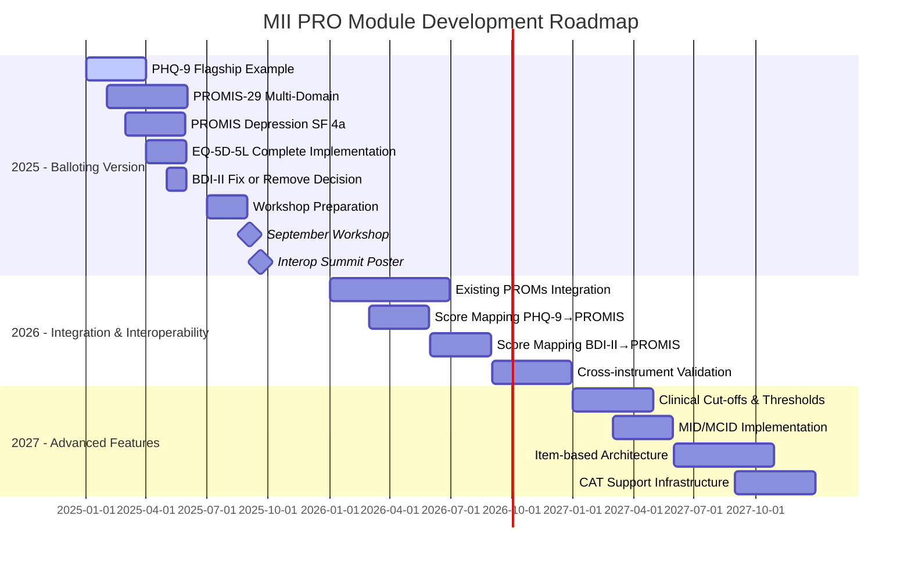

# KDS-PROMs Repository

## Overview
This repository contains a FHIR Implementation Guide (IG) for the **Medizininformatik Initiative (MII) Patient-Reported Outcomes (PRO) Extension Module**. It defines standardized FHIR profiles, questionnaires, and resources for collecting and managing patient-reported outcome measures in German healthcare contexts.

**Key Implementation Note**: This IG is primarily based on the [FHIR Structured Data Capture (SDC) specification](https://build.fhir.org/ig/HL7/sdc/), with many components leveraging SDC's advanced questionnaire capabilities for form rendering, data extraction, and calculations. Please note that both SDC components and certain FHIR specification elements used in this implementation are still under balloting and subject to change.

## Project Structure

### Core Components
- **FHIR IG**: Built using SUSHI (FSH to FHIR compiler) for FHIR R4
- **Language**: German (de-DE) with international coding systems
- **Version**: 2025.0.0-alpha (draft status)
- **Canonical URL**: https://www.medizininformatik-initiative.de/fhir/ext/modul-pro

### Implementation Strategy
**Current Focus**: Questionnaire → QuestionnaireResponse → Observation workflow
- Primary resources: Questionnaire, QuestionnaireResponse, Observation, ObservationDefinition
- **Future Exploration**: CQL libraries with Measure/MeasureReport resources for advanced analytics

### Terminology Strategy & German Healthcare Requirements

**Critical Implementation Constraint**: Standard international terminology servers (LOINC, HAPI FHIR) have fundamental limitations for German PRO implementation:

1. **Missing Scoring Weights**: LOINC answer lists (e.g., LL358-3) contain text answers but no numeric scoring weights, breaking calculated expressions
2. **Insufficient German Support**: Most questionnaire items lack proper German translations and cultural adaptations

**MII-Controlled Terminology Approach**:
```fsh
// Current reliable implementation
* answerValueSet = "http://mii.de/fhir/pro/ValueSet/mii-controlled-with-weights"
// OR direct answerOptions with scoring extensions
* answerOption[0].valueCoding.extension[ordinalValue].valueDecimal = 0
```

**Strategic Advantages**:
- **Reliable Calculated Expressions**: `.weight()` functions work consistently
- **German Language Support**: Proper translations and cultural appropriateness
- **Normative Authority**: Full control over item definitions and scoring algorithms
- **Foundation for Advanced Techniques**: Enables CAT, modular questionnaires, item-based scoring

**Future Interoperability Strategy**:
- Bridge to LOINC via external scoring (CQL/StructureMap) in later versions
- Maintain MII terminology for reliable calculations
- Support hybrid approaches for international interoperability

### Repository Structure & Naming Conventions

**Directory Structure**:
- `input/fsh/` - FSH (FHIR Shorthand) source files
  - `core/` - Core infrastructure (aliases.fsh, rules.fsh)
  - `profiles/` - FHIR profile definitions and extensions
  - `definitions/` - Questionnaire and resource definitions organized by instrument
    - `{instrument}/` - Individual instrument folders (bdi-ii, eq-5d, phq-9)
    - `domains/` - Cross-instrument domain mappings
  - `examples/` - Example instances
  - `logical-model/` - Logical models
- `fsh-generated/` - Auto-generated FHIR JSON resources
- `input/Images/` - UML diagrams and visual documentation

**File Naming Convention**: `mii-{type}-pro-{domain/instrument}-{specific}`

**Resource Type Prefixes**:
- `mii-pr-pro-` = Profiles (StructureDefinition)
- `mii-qst-pro-` = Questionnaires
- `mii-obsdef-pro-` = ObservationDefinitions
- `mii-cs-pro-` = CodeSystems
- `mii-vs-pro-` = ValueSets
- `mii-cm-pro-` = ConceptMaps
- `mii-ex-pro-` = Extensions
- `mii-exa-pro-` = Examples
- `mii-lib-` = CQL Libraries

**Examples**:
- `mii-pr-pro-questionnaire.fsh` - Base questionnaire profile
- `mii-qst-pro-phq-9.fsh` - PHQ-9 questionnaire instance
- `mii-obsdef-pro-score-eq5d5l-index.fsh` - EQ-5D-5L index score definition
- `mii-cs-pro-questionnaire-catalogue.fsh` - Questionnaire catalogue CodeSystem
- `mii-cm-pro-bdi-ii-to-promis-depression.fsh` - BDI-II to PROMIS mapping

### Supported PRO Instruments

#### 1. Beck Depression Inventory II (BDI-II)
- **Location**: `input/fsh/definitions/bdi-ii/`
- **Purpose**: Depression assessment questionnaire
- **Files**: 
  - Questionnaire definition (`mii-qst-pro-bdi-bdi2.fsh`)
  - CodeSystem and ValueSets
  - Response profiles

#### 2. PHQ-9 (Patient Health Questionnaire-9)
- **Location**: `input/fsh/definitions/phq-9/`
- **Purpose**: Depression screening tool
- **Features**: SDC rendering capabilities
- **Files**: 
  - Questionnaire with SDC rendering
  - Score observation definitions
  - LOINC-based answer lists

#### 3. EQ-5D-5L (EuroQol 5-Dimension 5-Level)
- **Location**: `input/fsh/definitions/eq-5d/`
- **Purpose**: Health-related quality of life assessment
- **Components**:
  - Multiple questionnaire variants (minimal, displayable, collectable)
  - Index, VAS, and profile scores
  - CQL libraries for calculations

### Technical Features

#### FHIR Profiles
- **MII_PR_PRO_Questionnaire**: Base questionnaire profile with SDC capabilities
- **MII_PR_PRO_QuestionnaireResponse**: Response capture profile
- **Score Profiles**: Blueprint and instance profiles for calculated scores

#### SDC-Based Capabilities
This implementation leverages the full spectrum of SDC advanced features:

**Form Behavior & Logic**:
- **Conditional Display**: Uses `enableWhen` and `enableWhenExpression` for dynamic question visibility
- **Calculated Expressions**: Automatic score calculations using FHIRPath expressions (visible in BDI-II total score calculation)
- **Initial Values**: Dynamic default value setting based on context
- **Validation**: Answer constraints, ranges, and required field enforcement

**Advanced Rendering**:
- **Styling Extensions**: Enhanced form presentation with HTML-like formatting
- **Control Types**: Specific input controls (sliders, choice orientations, collapsible sections)
- **Multi-language Support**: German primary with international coding system compatibility
- **Mobile Optimization**: Responsive design considerations

**Data Extraction Methods**:
- **Observation-based**: Direct conversion of questionnaire items to FHIR Observations
- **Definition-based**: Complex mapping to various FHIR resource types
- **Template-based**: Using contained templates with FHIRPath expressions
- **StructureMap-based**: Advanced data transformation capabilities

**Form Derivation**:
- **Questionnaire Variants**: Multiple versions (minimal, displayable, collectable) using derivation relationships
- **Adaptive Forms**: Context-specific questionnaire modifications
- **Modular Design**: Reusable questionnaire components

#### Extensions
- **Questionnaire Capabilities**: Defines displayable, collectable, calculatable, extractable, and domain-aligned capabilities
- **Score Health Correlation**: Links scores to health domains

#### Dependencies
- **FHIR R4 (4.0.1)**: Base FHIR specification
- **SDC (Structured Data Capture) 4.0.0-ballot**: Core dependency for advanced questionnaire functionality (⚠️ ballot status)
- **HL7 Terminology 6.4.0**: Standard terminologies
- **R5 Extensions for enhanced functionality**: Forward compatibility features (⚠️ some elements under balloting)

⚠️ **Ballot Status Notice**: Several key dependencies are in ballot status, meaning they may undergo changes before final release. This includes SDC capabilities for calculated expressions, advanced rendering, and some R5 extension elements.

### Build & Generation
- **SUSHI**: Converts FSH to FHIR JSON
- **Scripts**: Batch/shell scripts for continuous and one-time generation  
- **CI/CD**: GitHub Actions automated FHIR generation

### Implementation Guide Publishing Strategy
- **Primary IG Development**: Simplifier.net for collaborative editing and visual IG creation
- **Source Control**: Git repository maintains FSH source files and generated FHIR resources
- **Workflow**: 
  1. Develop FSH files in Git repository
  2. Generate FHIR resources with SUSHI
  3. Create and edit Implementation Guide in Simplifier
  4. Export final IG content from Simplifier back to Git
  5. Sync Git repository to Simplifier for version control

### Current Simplifier Implementation Guide
**URL**: https://simplifier.net/guide/mii-pro-v2026-de  
**Version**: 2025.0.4 (Published: 31.03.2025)  
**Status**: Active  

**Current IG Structure**:
- **Beschreibung Modul PROs** (Module Description)
- **Kontext im Gesamtprojekt** (Project Context) 
- **Referenzen** (References)
- **Ballotierungsfragen** (Balloting Questions)
- **Technical Implementation**: FHIR Profiles, Templates
- **Specific Questionnaires**: PHQ-9, EQ-5D-5L
- **Additional Sections**: Planned Scope, How to Use PROs, ID Systematics, Terminology Server, Mapping, Scoring, Derived Metrics

**Key Contributors**: Thomas Debertshäuser, Mathias Rose, Fabian Praßer, Karoline Buckow, Franziska Klepka

### Current Development Status
- **Branch**: `fix-initial-version-validation-errors`
- **Status**: Active development with validation error fixes
- **Recent Changes**: Updated EQ5D5L and BDI-II with latest logic

### Project Milestones & Roadmap



#### 2025 - First Balloting Version
**Primary Goal**: Establish working examples of complete PRO workflow with score calculations

**Must-Have for Balloting**:
- [ ] **PHQ-9** - Complete working example with full score calculation capabilities (flagship demonstration)
- [ ] **PROMIS-29** - Complete implementation including all domain scores (Depression, Anxiety, Physical Function, Pain, Fatigue, Sleep, Social Function)
- [ ] **PROMIS Depression SF 4a** - Complete PROMIS Depression Short Form 4a implementation
- [ ] **EQ-5D-5L** - Displayable and extractable implementation with all score variants (Index, VAS, Profile)
- [ ] **BDI-II** - Fix score calculation or make architectural decision to remove (nice-to-have feature)

**Key Milestones**: 
- **Workshop in September 2025** - Present MII PRO capabilities and gather community feedback
- **Interop Summit Poster (September 19, 2025)** - Showcase MII PRO module at international interoperability conference

**Success Criteria**:
- Questionnaire → QuestionnaireResponse → Observation workflow fully functional
- Calculated expressions working with MII-controlled terminology
- All necessary ObservationDefinitions and observation profiles implemented
- Clear demonstration of German PRO capabilities across multiple domains

#### 2026 - Integration & Interoperability
**Focus**: Expand ecosystem and integrate existing PROMs within limited capability constraints

- [ ] **EORTC QLQ-C30** - European Organisation for Research and Treatment of Cancer Quality of Life Questionnaire
- [ ] **Existing PROMs Integration** - Incorporate established questionnaires into MII framework
- [ ] **Cross-instrument Score Mapping** - PHQ-9 → PROMIS, BDI-II → PROMIS conversion algorithms
- [ ] **Validation Studies** - Clinical validation of mapped scores and existing PROM integrations

**⚠️ Terminology Strategy Update Needed**: Current IG mentions "Expandable/Terminologieserver" variants, but implementation should use MII-controlled terminology or run locally for reliable scoring.

#### 2027 - Advanced Architecture & Clinical Decision Support
**Focus**: Advanced features and clinical decision support integration

- [ ] **PRO-Score Evaluation & Clinical Interpretation**:
  - Cut-off values for clinical severity levels (mild, moderate, severe)
  - MID/MCID (Minimal Important Difference/Minimal Clinically Important Difference) thresholds
  - Population-specific normative ranges and percentiles  
  - Clinical categorization logic and decision support integration
  - Reliable change indices and measurement error boundaries
- [ ] **Item-based architecture** - Foundation for CAT, modular questionnaires
- [ ] **Comprehensive questionnaire catalogue system** - Versioning and capability management

### Architectural Challenges

#### Questionnaire Catalogue & Capability Management
The questionnaire catalogue system presents significant architectural complexity involving:

**Multi-Capability Questionnaires**:
- Single questionnaires with multiple variants (displayable, collectable, calculatable, extractable, domain-aligned)
- Dynamic capability switching based on use case requirements
- Capability inheritance and dependency management

**Versioning & Evolution**:
- Semantic versioning across questionnaire variants
- Backwards compatibility maintenance
- Migration paths between questionnaire versions
- Change impact analysis across dependent resources

**Use Case Adaptability**:
- Runtime switching between research, clinical, and screening contexts
- Context-specific capability requirements
- Dynamic questionnaire assembly based on use case profiles

**Catalogue Management**:
- Automated questionnaire discovery and registration
- Metadata standardization and governance
- Dependency tracking across questionnaires and mappings
- Quality assurance and validation workflows

This represents one of the most complex aspects of the implementation, requiring careful architectural planning to balance flexibility with maintainability.

#### ObservationDefinition Use Cases
**Multi-Score & Population-Specific Reference Ranges**:
The ObservationDefinition pattern addresses complex scoring scenarios:

**Multiple Scoring Measures**:
- Single questionnaire generating multiple calculated scores (e.g., EQ-5D with Index, VAS, Profile scores)
- Domain-specific sub-scores within comprehensive questionnaires
- Cross-questionnaire derived scores (e.g., PROMIS T-scores from legacy instruments)

**Population-Specific Reference Ranges**:
- Age-stratified reference ranges (pediatric, adult, geriatric populations)
- Indication-specific norms (e.g., depression scores in cardiac vs oncology patients)
- Cultural/linguistic population adjustments
- Clinical vs research population references

**Implementation Challenges**:
- Dynamic reference range selection based on patient context
- Version management across evolving population norms
- Governance of evidence-based reference range updates
- Integration with clinical decision support systems

Examples visible in repository: EQ-5D ObservationDefinitions for index, profile, and VAS scores (`input/fsh/definitions/eq-5d/mii-obsdef-pro-score-eq5d5l-*.fsh`)

### Architectural Design Decisions (Pending)

#### Score Observation Derivation Pattern
**Problem**: Need to clearly distinguish between scores derived directly from questionnaire responses vs scores calculated through mapping from other scores (e.g., PHQ-9 → PROMIS Depression).

**Current State**: 
- Generic `MII_PR_PRO_Score_Instance` profile exists
- Has basic `derivedFrom` element without specific semantics
- Need clear traceability for validation and clinical decision support

**Proposed Solutions Under Consideration**:

**Option 1: Method-based Slicing**
```fsh
* method ^slicing to distinguish:
  - questionnaire-based calculation methods
  - mapping-based calculation methods
* derivedFrom points to source (QuestionnaireResponse or Observation)
```
*Pros*: Semantically correct use of FHIR method element, single profile
*Cons*: Complex slicing, method semantics unclear for mappings

**Option 2: DerivedFrom Slicing** 
```fsh
* derivedFrom ^slicing:
  - questionnaireResponse slice → Reference(QuestionnaireResponse)
  - scoreMapping slice → Reference(Observation)
```
*Pros*: Clear source traceability, intuitive semantics
*Cons*: Requires documenting mapping algorithms somewhere, complex when both present

**Option 3: Separate Profiles**
```fsh
MII_PR_PRO_Score_Questionnaire_Based
MII_PR_PRO_Score_Mapping_Based
```
*Pros*: Explicit intent, cleaner validation, specific constraints per type
*Cons*: Profile proliferation, need common base, harder to query across types

**Option 4: Single Profile with Invariants**
```fsh
MII_PR_PRO_Score_Instance + invariants:
"If method=questionnaire → derivedFrom must be QuestionnaireResponse"
"If method=mapping → derivedFrom must be Observation + mapping reference"
```
*Pros*: Flexible, single profile, enforced consistency
*Cons*: Complex invariant logic, harder to understand intent

**Dependencies Requiring Resolution**:
1. **Mapping Documentation Strategy**: How to formally document PHQ-9→PROMIS, BDI-II→PROMIS mappings (ConceptMap, CQL, StructureMap?)
2. **Validation Requirements**: Clinical vs research validation needs
3. **Query Patterns**: How consumers will search/filter observation types
4. **Governance**: Version management across mapping algorithms
5. **Performance**: Impact on FHIR server indexing and search

**Decision Criteria to Consider**:
- Implementer complexity vs semantic clarity
- Validation and quality assurance requirements  
- Integration with clinical decision support systems
- Maintenance burden vs architectural flexibility
- Interoperability with external FHIR systems

**Related Milestones**: Impacts questionnaire catalogue design, mapping implementation, and IG documentation structure.

#### Item-Based Score Calculation Strategy (Future Major Version)
**Architectural Vision**: Transition from questionnaire-centric to **item-centric** score calculation for maximum flexibility and reusability.

**Core Concept**: Similar to BMI calculation (weight + height from any source), PRO scores should be calculable from constituent items regardless of source questionnaire.

**Use Cases Enabled**:
- **PROMIS Depression SF 4a**: Calculate from 4 specific items present in PROMIS-29, standalone questionnaires, or mixed sources
- **Modular Questionnaires**: Dynamic questionnaire assembly with consistent scoring
- **Computer Adaptive Testing (CAT)**: Score calculation from adaptively selected items
- **Retrospective Score Analysis**: Calculate new scores from historical data using different item combinations

**Implementation Architecture**:

**Component-Based Observation Structure**:
```fsh
Observation: PROMIS_Depression_SF4a_Score
* valueQuantity: final T-score (calculated)
* component[0]: PROMIS depression item 1 response
* component[1]: PROMIS depression item 2 response  
* component[2]: PROMIS depression item 3 response
* component[3]: PROMIS depression item 4 response
* method: Reference to calculation algorithm
```

**Calculation Implementation Options**:

**Option A: StructureMap (FHIR Mapping Language)**
- **Strengths**: Designed for FHIR resource transformation, good for item extraction
- **Limitations**: Basic arithmetic only, limited for complex statistical calculations
- **Use Case**: Item extraction from QuestionnaireResponse + simple scoring algorithms

**Option B: CQL (Clinical Quality Language)**  
- **Strengths**: Designed for clinical logic, better for complex calculations
- **Limitations**: More complex integration, requires CQL execution environment
- **Use Case**: Complex scoring algorithms, statistical transformations

**Option C: Hybrid Approach**
- **StructureMap**: Extract items from QuestionnaireResponse → component-based Observation
- **CQL**: Calculate complex scores (T-scores, standardized scores) from component values
- **Best of both**: Resource transformation + advanced calculation capabilities

**Technical Requirements**:
1. **Canonical Item Identifiers**: MII-defined item banks with consistent linkIds across questionnaires
2. **Item Semantic Equivalence**: Ensuring items maintain meaning across different questionnaire contexts
3. **Calculation Metadata**: Formal documentation of required items and algorithms for each score
4. **Validation Logic**: Ensuring clinical validity when items sourced from different questionnaires

**Advantages**:
- Maximum reusability across questionnaire implementations
- Support for advanced questionnaire techniques (CAT, modular design)
- Flexible data collection strategies
- Future-proof for evolving scoring methodologies
- Reduced redundancy in comprehensive assessments

**Implementation Challenges**:
- Requires FHIR servers with advanced mapping/extraction capabilities
- Complex governance for item-level semantic consistency
- Performance implications for real-time score calculation
- Integration with existing questionnaire-based workflows

**Current Repository Status**: Foundation elements present (CQL files: `mii-lib-eq-5d.cql`, `mii-lib-phq-9.cql`) but full item-based architecture planned for future major version.

**Strategic Value**: Positions MII PRO module as leader in flexible, reusable PRO implementations while maintaining normative authority over German healthcare item definitions.

### Use Cases
1. **ePRO Collection**: Electronic patient-reported outcome collection
2. **Local Harmonization**: Standardizing PRO data within institutions
3. **Inter-hospital Harmonization**: Cross-institutional data sharing
4. **Cross-domain Harmonization**: Linking PRO data across health domains

This repository represents a comprehensive approach to standardizing patient-reported outcome measures within the German medical informatics initiative, providing interoperable FHIR-based solutions for healthcare institutions.