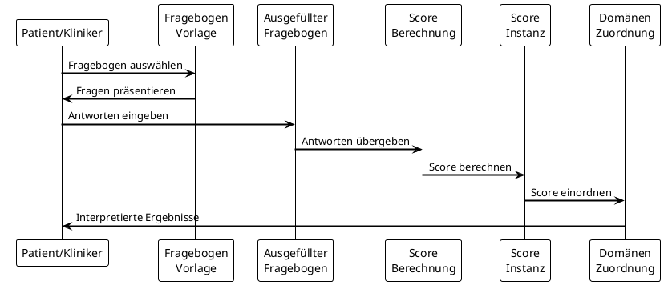

## Datensätze inkl. Beschreibungen

Das MII PRO Modul definiert ein logisches Datenmodell für die standardisierte Erfassung und Verarbeitung von Patient-Reported Outcomes. Dieses Informationsmodell bildet die konzeptuelle Grundlage für alle FHIR-Profile und beschreibt die Beziehungen zwischen den verschiedenen Komponenten des PRO-Workflows.

Die offiziell beschlossene Version des Informationsmodells befinden sich auf [Art-Decor](https://art-decor.org/art-decor/decor-datasets--mide-?id=2.16.840.1.113883.3.1937.777.24.1.1&effectiveDate=2018-06-05T12%3A44%3A12&conceptId=2.16.840.1.113883.3.1937.777.24.2.3758&conceptEffectiveDate=2024-06-27T13%3A15%3A46&language=de-DE). Zur Vereinheitlichung der Repräsentation wurde das Informationsmodell zusätzlich als FHIR Logical Model abgebildet:

{{tree, expand}}

*Es ist zu beachten, dass das Logical Model rein auf die Abbildung der Datenelemente und deren Beschreibung abzielt. Verwendete Datentypen und Kardinalitäten sind nicht als verpflichtend anzusehen. Dies wird abschließend durch die FHIR-Profile festgelegt. Für jedes Element innerhalb des Logical Models existiert ein 1:1 Mapping auf ein Element einer konkreten FHIR Ressource.*

<fql headers="true">
    from 
        StructureDefinition 
    where 
        url = %canonical
    for 
        differential.element
    select
        'Logischer Datensatz': path.replace('mii-lm-pro.', '').replace('.', '. '),
        'Beschreibung': definition
</fql>

<!--

### Datenfluss im PRO-System

Der folgende Ablauf zeigt, wie die verschiedenen Komponenten im PRO-Workflow zusammenwirken:

### Implementierungshinweise

Das logische Modell dient als konzeptuelle Grundlage und wird in der Praxis durch die konkreten FHIR-Profile umgesetzt. Dabei gelten folgende Prinzipien:

1. **Abstraktion vor Implementierung**: Das logische Modell beschreibt die Konzepte unabhängig von technischen Details
2. **Flexibilität**: Nicht alle Elemente des logischen Modells müssen in jeder Implementierung vorhanden sein
3. **Erweiterbarkeit**: Das Modell kann für spezifische Anwendungsfälle erweitert werden
4. **Interoperabilität**: Die FHIR-Mappings gewährleisten den Datenaustausch zwischen Systemen

### Validierung und Qualitätssicherung

Die Implementierung des logischen Modells wird durch folgende Mechanismen validiert:

- **Strukturelle Validierung**: FHIR-Profile erzwingen die korrekte Struktur
- **Terminologie-Bindung**: Verwendung standardisierter Codesysteme
- **Geschäftsregeln**: Invarianten und Constraints in den Profilen
- **Berechnungsvalidierung**: Definierte Algorithmen für Score-Berechnungen

### Zukunftsperspektiven

Das logische Modell bildet die Grundlage für zukünftige Erweiterungen:

- **Modulare Fragebögen**: Wiederverwendbare Fragebogen-Komponenten
- **Computer Adaptive Testing (CAT)**: Dynamische Fragebogenanpassung
- **Mehrsprachigkeit**: Vollständige i18n-Unterstützung
- **Advanced Analytics**: Komplexe statistische Auswertungen

-->