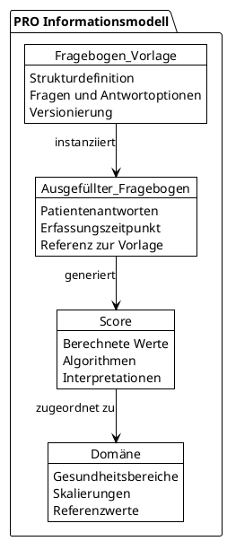
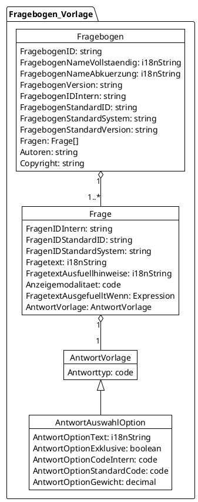
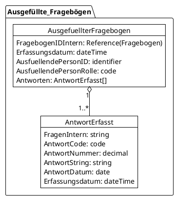
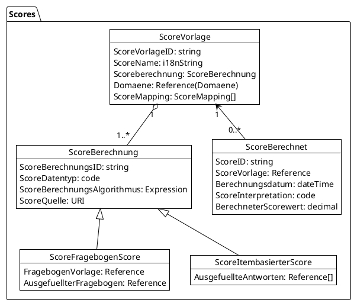
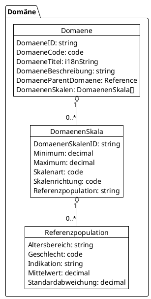
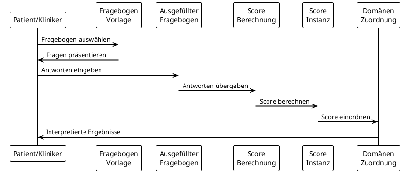

## Datensätze inkl. Beschreibungen

Das MII PRO Modul definiert ein logisches Datenmodell für die standardisierte Erfassung und Verarbeitung von Patient-Reported Outcomes. Dieses Informationsmodell bildet die konzeptuelle Grundlage für alle FHIR-Profile und beschreibt die Beziehungen zwischen den verschiedenen Komponenten des PRO-Workflows.

### Informationsmodell Übersicht

Das PRO-Informationsmodell besteht aus vier Hauptkomponenten, die miteinander interagieren, um den vollständigen Lebenszyklus von Patient-Reported Outcomes abzubilden:

### FHIR Logical Model

Das logische Modell (`MII_LM_PRO`) definiert die abstrakte Struktur der PRO-Daten unabhängig von der konkreten FHIR-Implementierung. Es dient als Brücke zwischen der konzeptuellen Ebene und der technischen Umsetzung in FHIR-Ressourcen.

<tabs>
  <tab title="Struktur">
    {{tree:https://www.medizininformatik-initiative.de/fhir/ext/modul-pro/StructureDefinition/mii-lm-pro}}
  </tab>
  <tab title="JSON">
    {{json:https://www.medizininformatik-initiative.de/fhir/ext/modul-pro/StructureDefinition/mii-lm-pro}}
  </tab>
  <tab title="XML">
    {{xml:https://www.medizininformatik-initiative.de/fhir/ext/modul-pro/StructureDefinition/mii-lm-pro}}
  </tab>
</tabs>

### Komponente 1: Fragebogen-Vorlage

Die Fragebogen-Vorlage definiert die Struktur und den Inhalt eines PRO-Instruments. Sie enthält alle notwendigen Informationen zur Darstellung, Erfassung und Auswertung der Fragen.

**FHIR-Mapping**: Die Fragebogen-Vorlage wird auf die FHIR-Ressource `Questionnaire` gemappt. Die hierarchische Struktur der Fragen wird durch `Questionnaire.item` abgebildet, während Antwortoptionen in `answerOption` definiert werden.

### Komponente 2: Ausgefüllter Fragebogen

Der ausgefüllte Fragebogen erfasst die konkreten Antworten eines Patienten zu einem bestimmten Zeitpunkt. Er referenziert die zugrundeliegende Fragebogen-Vorlage und speichert die gegebenen Antworten strukturiert ab.

**FHIR-Mapping**: Der ausgefüllte Fragebogen wird auf `QuestionnaireResponse` gemappt. Die einzelnen Antworten werden in `QuestionnaireResponse.item.answer` gespeichert, wobei verschiedene Datentypen unterstützt werden.

### Komponente 3: Score-Berechnung

Die Score-Komponente umfasst sowohl die Definition von Berechnungsalgorithmen (Score-Vorlage) als auch die konkreten berechneten Werte (Score-Instanz). Sie unterstützt verschiedene Berechnungsarten und ermöglicht Mappings zwischen unterschiedlichen Scoring-Systemen.

**Unterscheidung der Score-Typen**:
- **ScoreFragebogenScore**: Berechnung basiert auf einem vollständigen ausgefüllten Fragebogen
- **ScoreItembasierterScore**: Berechnung basiert auf einzelnen Items aus möglicherweise verschiedenen Fragebögen

**FHIR-Mapping**: 
- Score-Vorlagen werden auf `ObservationDefinition` gemappt
- Berechnete Scores werden als `Observation` gespeichert
- Die Verbindung zur Datenquelle erfolgt über `Observation.derivedFrom`

### Komponente 4: Domänen

Domänen klassifizieren PRO-Scores nach Gesundheitsbereichen und ermöglichen die Einordnung in übergeordnete Konzepte. Sie definieren Skalierungen und Referenzwerte für die Interpretation der Scores.

**FHIR-Mapping**: Domänen werden primär durch Terminologie-Ressourcen (`CodeSystem`, `ValueSet`) und Metadaten in den Score-Definitionen abgebildet.

### Datenfluss im PRO-System

Der folgende Ablauf zeigt, wie die verschiedenen Komponenten im PRO-Workflow zusammenwirken:

### Implementierungshinweise

Das logische Modell dient als konzeptuelle Grundlage und wird in der Praxis durch die konkreten FHIR-Profile umgesetzt. Dabei gelten folgende Prinzipien:

1. **Abstraktion vor Implementierung**: Das logische Modell beschreibt die Konzepte unabhängig von technischen Details
2. **Flexibilität**: Nicht alle Elemente des logischen Modells müssen in jeder Implementierung vorhanden sein
3. **Erweiterbarkeit**: Das Modell kann für spezifische Anwendungsfälle erweitert werden
4. **Interoperabilität**: Die FHIR-Mappings gewährleisten den Datenaustausch zwischen Systemen

### Validierung und Qualitätssicherung

Die Implementierung des logischen Modells wird durch folgende Mechanismen validiert:

- **Strukturelle Validierung**: FHIR-Profile erzwingen die korrekte Struktur
- **Terminologie-Bindung**: Verwendung standardisierter Codesysteme
- **Geschäftsregeln**: Invarianten und Constraints in den Profilen
- **Berechnungsvalidierung**: Definierte Algorithmen für Score-Berechnungen

### Zukunftsperspektiven

Das logische Modell bildet die Grundlage für zukünftige Erweiterungen:

- **Modulare Fragebögen**: Wiederverwendbare Fragebogen-Komponenten
- **Computer Adaptive Testing (CAT)**: Dynamische Fragebogenanpassung
- **Mehrsprachigkeit**: Vollständige i18n-Unterstützung
- **Advanced Analytics**: Komplexe statistische Auswertungen