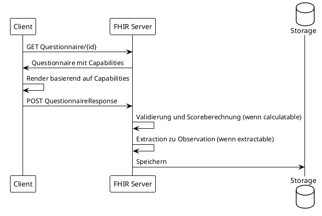

## Developer Reference

Diese Referenz bietet eine kompakte Übersicht über alle technischen Aspekte der MII PRO Implementierung. Sie dient als schnelle Nachschlageressource für Entwickler, die PRO-Instrumente implementieren oder in bestehende Systeme integrieren möchten.

### Namenskonventionen

Alle MII PRO Ressourcen folgen einem konsistenten Namensschema, das die Identifikation und Zuordnung erleichtert.

#### Ressourcen-Präfixe

| Präfix | Ressourcentyp | Beispiel |
|--------|---------------|----------|
| `mii-pr-pro-` | Profile (StructureDefinition) | `mii-pr-pro-questionnaire` |
| `mii-qst-pro-` | Questionnaires | `mii-qst-pro-phq-9` |
| `mii-obsdef-pro-` | ObservationDefinitions | `mii-obsdef-pro-phq9-score` |
| `mii-cs-pro-` | CodeSystems | `mii-cs-pro-questionnaire-catalogue` |
| `mii-vs-pro-` | ValueSets | `mii-vs-pro-bdi-bdi2-long` |
| `mii-cm-pro-` | ConceptMaps | `mii-cm-pro-phq9-to-promis` |
| `mii-ex-pro-` | Extensions | `mii-ex-pro-questionnaire-capabilities` |
| `mii-exa-pro-` | Examples | `mii-exa-pro-phq-9-response` |
| `mii-lib-` | CQL Libraries | `mii-lib-phq-9` |

#### LinkId Patterns

LinkIds in Questionnaires folgen spezifischen Mustern für verschiedene Itemtypen. Diese Patterns ermöglichen die automatische Verarbeitung durch FHIRPath-Expressions.

**Standard Items**: `{instrument}-q{nummer}` (z.B., `phq-phq9-q01`)
**Berechnete Scores**: `{instrument}-total-score` (z.B., `phq9-total-score`)
**Varianten-spezifisch**: `{instrument}-{variant}-q{nummer}` (z.B., `euroqol-eq5d5l-coded-q01-MO`)

### Capability-Architektur

Die Questionnaire-Capabilities werden als boolesche Sub-Extensions implementiert und bestimmen das Verhalten der Fragebögen.

```fsh
Extension: MII_PR_PRO_Questionnaire_Capabilities
* extension contains 
    displayable 0..1 MS and     // Nur Anzeige
    collectable 0..1 MS and     // Datenerfassung
    populatable 0..1 MS and     // Vorausfüllung
    extractable 0..1 MS and     // Extraktion zu Observations
    calculatable 0..1 MS and    // Score-Berechnung
    domainAligned 0..1 MS       // Domain-Mapping verfügbar
```

#### Capability-Kombinationen für Use Cases

| Use Case | Benötigte Capabilities |
|----------|------------------------|
| Patientenportal | collectable + calculatable + displayable |
| Mobile App (nur Erfassung) | collectable |
| Server-Berechnung | populatable + calculatable + extractable |
| Klinische Ansicht | displayable |
| Datenharmonisierung | populatable + domainAligned |

### FHIRPath Expressions

Die automatische Score-Berechnung erfolgt derzeit v.a. durch FHIRPath-Expressions. Diese Referenz zeigt die wichtigsten Patterns.

#### Basis-Patterns

```fhirpath
// Einfache Summe aller Antworten
%resource.item.answer.value.ordinal().sum()

// Summe mit Item-Selektion via Regex
%resource.item.where(linkId.matches('^phq-.*-q0[1-9]$'))
  .answer.value.ordinal().sum()

// Verwendung von Variablen
%rawScore = %resource.item.answer.value.ordinal().sum()
%tScore = iif(%rawScore < 5, 41.0, iif(%rawScore < 10, 50.0, 60.0))
```

#### Populatable Patterns

```fhirpath
// Vorausfüllung aus existierender Response
iif(%sourceResponse.exists(), 
    %sourceResponse.item.where(linkId='q1').answer.value, 
    {})

// Mit Fallback für fehlende Werte
%sourceResponse.item.where(linkId='q1').answer.value | {}
```

### SDC Extensions

Die Implementierung nutzt zentrale SDC (Structured Data Capture) Extensions. Diese Extensions erweitern die Standard-Questionnaire-Funktionalität um erweiterte Features.

| Extension | Verwendung | Beispiel |
|-----------|------------|----------|
| `calculatedExpression` | Automatische Score-Berechnung | Score-Items |
| `initialExpression` | Vorausfüllung von Items | Populatable Questionnaires |
| `ordinalValue` | Numerische Werte für Antworten | Scoring-Antworten |
| `variable` | Definition wiederverwendbarer Variablen | Multi-Score-Berechnungen |
| `observationExtract` | Markierung für Extraktion | Score-Items zu Observations |

### Implementierungsansätze

#### All-in-One vs. Varianten-Architektur

Die Wahl der Architektur hängt von der Komplexität des Instruments und den Anwendungsfällen ab.

**All-in-One Ansatz (PHQ-9 Beispiel)**:
Alle Capabilities sind in einer einzigen Questionnaire-Ressource vereint. Dieser Ansatz eignet sich für einfache Instrumente mit klaren, stabilen Anforderungen. Die Implementierung ist straightforward, führt aber zu größeren Ressourcen.

**Varianten-Architektur (EQ-5D-5L Beispiel)**:
Capabilities werden auf spezialisierte Varianten verteilt, die von einer gemeinsamen Basis abgeleitet sind. Dieser Ansatz bietet optimierte Ressourcen für spezifische Use Cases und bessere Wartbarkeit bei komplexen Instrumenten.

### Workflow-Implementation

Der Standard-Workflow folgt dem Pattern Questionnaire → QuestionnaireResponse → Observation. Die konkrete Implementierung hängt von den verfügbaren Capabilities ab.



### Score-Implementierung

Scores werden auf mehreren Ebenen repräsentiert, um verschiedene Anwendungsfälle zu unterstützen.

#### Score-Ebenen

1. **Berechnetes Item in QuestionnaireResponse**: Direkt verfügbar, Teil der Response
2. **Extrahierte Observation**: Strukturiert für Analysen, LOINC-kodiert
3. **Domain-gemappter Score**: Harmonisiert über Instrumente (z.B., PROMIS T-Score)

#### ObservationDefinition Pattern

ObservationDefinitions dienen als Blueprints für Score-Observations und definieren Wertebereiche, Einheiten und Interpretationen.

```fsh
Instance: ScoreObservationDefinition
* code = $LNC#44261-6 "PHQ-9 total score"
* quantitativeDetails.unit = $UCUM#{score}
* validCodedValueSet = "ValueSet/phq9-interpretation"
* qualifiedInterval[+].range.low = 0
* qualifiedInterval[=].range.high = 27
```

### Terminologie-Strategie

Die MII PRO Implementierung verwendet eine hybride Terminologie-Strategie, die internationale Standards mit MII-kontrollierten Codes kombiniert.

#### MII-kontrollierte Terminologie

MII-eigene CodeSystems werden verwendet, wenn internationale Terminologien unzureichend sind. Dies betrifft insbesondere deutsche Übersetzungen und Scoring-Gewichte. Die MII-kontrollierten Codes ermöglichen zuverlässige ordinale Werte für Berechnungen und vollständige deutsche Sprachunterstützung.

#### LOINC-Integration

Wo möglich werden LOINC-Codes verwendet, insbesondere für Questionnaire-Items und Score-Observations. Antwortspezifische Scorewerte sind in der LOINC-Distributionen und auf der Webseite hinterlegt, der LOINC-HAPI-Terminologieservice gibt jedoch nur Antwortlisten ohne Scores aus. Bei fehlenden Scoring-Gewichten in LOINC Answer Lists wird auf MII-kontrollierte ValueSets ausgewichen. ACHTUNG: Die derzeitige Validierungs-Infrastruktur erkennt LOINC-AnswerCodes nicht als LOINC-Codes (LA-XX) und wirft dabei Fehler. 

### Fehlerbehandlung

Robuste Implementierungen sollten verschiedene Fehlerszenarien berücksichtigen.

**Unvollständige Responses**: Scores sollten nur berechnet werden, wenn alle erforderlichen Items beantwortet sind. Optional kann eine Imputation-Strategie implementiert werden.

**Ungültige Werte**: Validierung sollte sicherstellen, dass nur erlaubte Werte akzeptiert werden. Bei ordinalen Werten muss der Bereich (z.B., 0-3) strikt eingehalten werden. 


### Testing und Validierung

Implementierungen sollten gegen die bereitgestellten Beispiel-Ressourcen getestet werden. Jedes implementierte Instrument hat mindestens eine Beispiel-QuestionnaireResponse und die entsprechenden extrahierten Observations.

**Unit Tests** sollten FHIRPath-Expressions isoliert testen. **Integrationstests** sollten den kompletten Workflow von Questionnaire bis Observation abdecken. **Validierung** gegen die FHIR-Profile und die bereitgestellten Questionnaire-Definitionen stellt die Konformität sicher.

### Versionierung

Das MII PRO Modul folgt kalendarischer Versionierung (YEAR.MINOR.PATCH). Breaking Changes führen zu Minor-Version-Updates. Neue Instrumente oder Capabilities sind Minor-Updates. Bugfixes und Dokumentationsänderungen sind Patch-Updates.

### Referenz-Implementierungen

Referenz-Implementierungen sind für folgende Komponenten verfügbar:

**PHQ-9**: Vollständige Implementierung mit allen Capabilities, demonstriert All-in-One-Ansatz
**EQ-5D-5L**: Varianten-Architektur mit getrennten Capabilities, zeigt modularen Ansatz
**Workflow-Patterns**: Generische Patterns für verschiedene Use Cases

### Support und Community

Fragen zur Implementierung können im FHIR-Chat unter chat.fhir.org im Stream 'german/mi-initiative' oder in MII-iternen Zulip gestellt werden. Issues und Verbesserungsvorschläge sollten im GitHub-Repository eingereicht werden. Die technische Dokumentation wird kontinuierlich aktualisiert basierend auf Implementierungserfahrungen.