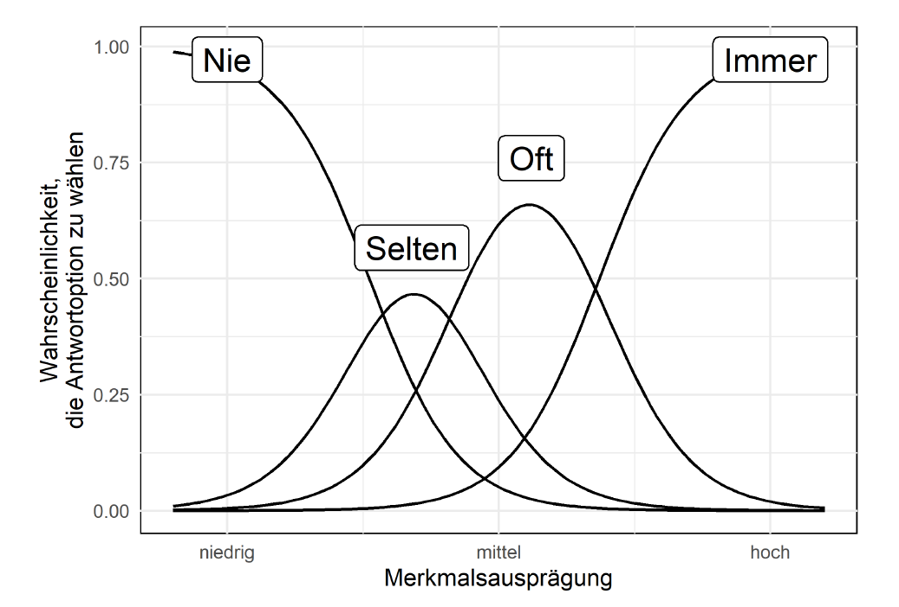
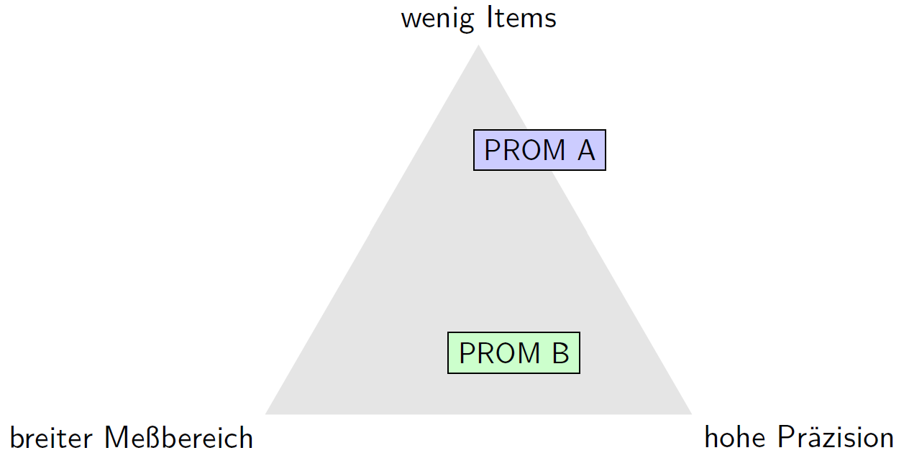
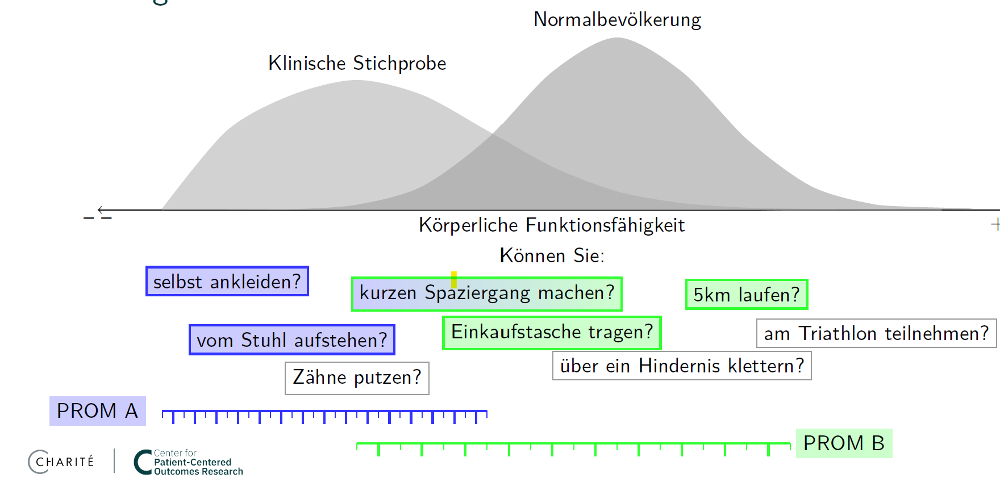

## {{page-title}}

### Warum Domain-basiertes Scoring?

Die Harmonisierung von Patient-Reported Outcomes über verschiedene Messinstrumente ist eine zentrale Herausforderung der modernen Versorgungsforschung. Domain-basiertes Scoring löst das Problem der Fragmentierung durch die Abbildung verschiedener Instrumente auf gemeinsame Gesundheitsdomänen.

**Verwandte Seiten:**
- [Gesundheitsdomänen](Domaenen.page.md) - Definition der 9 PROMIS Core Domains
- [Cross-Instrument Mappings](Cross-Instrument-Mappings.page.md) - Konkrete Mapping-Tabellen
- [Scoring Methodologie](../Technische-Implementierung/Scoring.page.md) - Technische Details

### Kernkonzept

#### Von Instrumenten zu Domänen

Verschiedene Fragebögen messen oft dasselbe Konstrukt:
- **Depression**: PHQ-9, BDI-II, PROMIS Depression, HADS-D
- **Angst**: GAD-7, PROMIS Anxiety, HADS-A
- **Körperliche Funktion**: PROMIS PF, SF-36 PF, HAQ

Domain-basiertes Scoring ermöglicht die Vergleichbarkeit durch Transformation auf eine gemeinsame Metrik (T-Scores mit Mean=50, SD=10).

### Implementierung: Depression-Domäne

Die Depression-Domäne demonstriert als erste vollständig implementierte Domäne den Ansatz:

#### FHIR-Architektur

```fhir
ObservationDefinition: mii-obsdef-pro-depression-t-score
├── Code: LOINC#77861-3 "PROMIS Depression T-score"
├── Referenzbereiche: EHIS Wave 3 (n=287,530)
└── Populationsnormen: DE, EU, altersstratifiziert

Observation: Depression T-Score Instance
├── instantiates: ObservationDefinition
├── derivedFrom: QuestionnaireResponse oder Raw Score
└── method: IRT-Berechnung oder Cross-Walking
```

#### Mapping-Strategien

**1. Item Response Theory (IRT)**



**Abbildung 1:** *Item Response Theory - Antwortwahrscheinlichkeiten in Abhängigkeit von der Merkmalsausprägung*

Die Abbildung zeigt die charakteristischen Kurven der Item Response Theory:
- Bei niedriger Merkmalsausprägung (z.B. geringe Depression) ist die Wahrscheinlichkeit für "Nie" am höchsten
- Mit steigender Merkmalsausprägung verschieben sich die Wahrscheinlichkeiten zu "Selten", "Oft" und schließlich "Immer"
- Die Überlappungsbereiche zeigen Unsicherheitszonen, wo verschiedene Antworten ähnlich wahrscheinlich sind

IRT-Vorteile:
- Direkte Berechnung aus Item-Antworten
- Präzise, aber aufwendig zu implementieren
- Ideal für PROMIS-Instrumente

**2. Cross-Walking Tabellen**
- Empirisch validierte Konversionstabellen
- PHQ-9 (0-27) → T-Score (40-85)
- BDI-II (0-63) → T-Score (40-85)
- Basierend auf Equiperzentil-Matching

#### Mapping-Limitationen

Bei der Anwendung von Cross-Walking sind folgende Einschränkungen zu beachten:

1. **Bereichsüberschreitungen**: Extreme Werte können theoretische Grenzen überschreiten
2. **Diskretisierung**: Kontinuierliche Verteilungen werden auf diskrete Werte abgebildet
3. **Präzisionsverlust**: Besonders bei kurzen Instrumenten (z.B. 4-Item → Full Domain)
4. **Validierungsbedarf**: Mappings bedürfen populationsspezifischer Validierung

**Empfehlung**: Für klinische Entscheidungen sollten Mapping-Konfidenzintervalle berücksichtigt werden. Für Forschungszwecke ist die Verwendung bei transparenter Dokumentation des Mapping-Fehlers unproblematisch.

### Das PRO-Spannungsfeld



**Abbildung 2:** *Das Spannungsfeld zwischen Item-Anzahl, Messbereich und Präzision*

Diese Abbildung illustriert ein fundamentales Dilemma bei der PRO-Auswahl:
- **PROM A** (oben): Wenige Items, aber eingeschränkter Messbereich oder Präzision
- **PROM B** (unten): Breiter Messbereich und hohe Präzision, aber mehr Items erforderlich

Domain-basiertes Scoring löst dieses Dilemma durch:
- **Flexible Instrumentenauswahl** je nach Kontext
- **Item Banking** für adaptive Tests
- **Harmonisierte Scores** trotz unterschiedlicher Instrumente

### Item Banking und Adaptive Messung



**Abbildung 3:** *Item Banking für die Domäne Körperliche Funktionsfähigkeit*

Das Item Banking Konzept ermöglicht:
- **Populationsspezifische Item-Auswahl**: Verschiedene Items für klinische Stichproben vs. Normalbevölkerung
- **Adaptive Messung**: Items werden basierend auf der geschätzten Fähigkeit ausgewählt
- **Beispiele im Bild**:
  - Einfache Items (links): "selbst ankleiden?", "vom Stuhl aufstehen?", "Zähne putzen?"
  - Mittlere Items (Mitte): "kurzen Spaziergang machen?", "Einkaufstasche tragen?"
  - Schwierige Items (rechts): "5km laufen?", "über ein Hindernis klettern?", "am Triathlon teilnehmen?"

Diese adaptive Strategie ermöglicht präzise Messung über das gesamte Fähigkeitsspektrum mit minimaler Belastung für Patienten.

### Praktische Anwendung

#### Use Case 1: Longitudinales Monitoring
Patient startet mit PHQ-9 in Hausarztpraxis, wechselt zu PROMIS Depression in Klinik:
- Beide Scores werden auf Depression T-Score gemappt
- Kontinuierliche Verlaufskurve trotz Instrumentenwechsel
- Reliable Change Index über Instrumente hinweg berechenbar

#### Use Case 2: Multi-Site Studien
Verschiedene Zentren nutzen unterschiedliche Instrumente:
- Zentrum A: BDI-II
- Zentrum B: PHQ-9
- Zentrum C: PROMIS Depression
→ Alle Daten vergleichbar durch Domain T-Scores

#### Use Case 3: Qualitätssicherung
Benchmarking zwischen Einrichtungen:
- Einheitliche Outcome-Metriken trotz verschiedener Assessment-Strategien
- Populationsadjustierte Vergleiche möglich
- Faire Qualitätsindikatoren

### Technische Implementierung

#### ConceptMaps für Mapping
```fsh
Instance: PHQ9-to-PROMIS-Depression
InstanceOf: ConceptMap
* sourceCanonical = "Questionnaire/phq-9"
* targetCanonical = "ObservationDefinition/depression-t-score"
* group.element[+]
  * code = #score-range-0-4
  * target.code = #t-score-40-45
  * target.equivalence = #equivalent
```

#### CQL für komplexe Berechnungen (ab 2026)
```cql
define "Depression T-Score from PHQ-9":
  case
    when PHQ9Score between 0 and 4 then 42.5
    when PHQ9Score between 5 and 9 then 50.0
    when PHQ9Score between 10 and 14 then 60.0
    when PHQ9Score between 15 and 19 then 70.0
    when PHQ9Score >= 20 then 77.5
    else null
  end
```

### Zukünftige Erweiterungen

#### Geplante Domänen (2026-2027)
- **Angst-Domäne**: GAD-7, PROMIS Anxiety, HADS-A
- **Schmerz-Domäne**: BPI, PROMIS Pain, NRS
- **Körperliche Funktion**: PROMIS PF, HAQ, WHODAS

#### Erweiterte Funktionalität
- **Composite Scores**: Gewichtete Aggregation mehrerer Instrumente
- **Adaptive Schwellenwerte**: Populationsspezifische Cut-offs
- **Measurement Error Propagation**: Unsicherheitsquantifizierung

### Vorteile für die Praxis

1. **Kontinuität**: Instrumentenwechsel ohne Datenverlust
2. **Vergleichbarkeit**: Einrichtungsübergreifende Benchmarks
3. **Flexibilität**: Freie Instrumentenwahl bei erhaltener Vergleichbarkeit
4. **Skalierbarkeit**: Neue Instrumente integrierbar ohne Systemumbau

### Zusammenfassung

Domain-basiertes Scoring ist essentiell für die Harmonisierung von PRO-Daten im deutschen Gesundheitswesen. Die Depression-Domäne zeigt die praktische Umsetzbarkeit und bildet die Grundlage für weitere Domänen. Trotz methodischer Herausforderungen beim Cross-Walking überwiegen die Vorteile für Versorgung und Forschung deutlich.

**Weiterführende Informationen:**
- [Übersicht Gesundheitsdomänen](Domaenen.page.md) - Detaillierte Beschreibung aller 9 PROMIS Domänen
- [Mapping-Tabellen](Cross-Instrument-Mappings.page.md) - Konkrete Konversionstabellen für Depression
- [PHQ-9 Implementierung](../PRO-Bibliothek/PHQ-9/Index.page.md) - Referenzimplementierung
- [FHIR-Profile](../Technische-Implementierung/FHIR-Profile/Abstrakte-Profile.page.md) - Technische Spezifikation
- [Developer Reference](../Developer-Reference.page.md) - Implementierungshandbuch