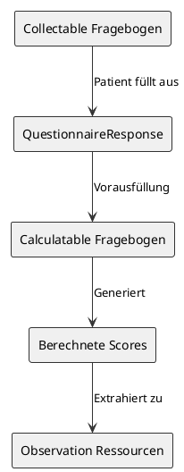

## Extension: Questionnaire Capabilities

Das Modul implementiert ein Muster zur Trennung der Verwendungsmöglichkeiten für Fragebögen (sog. *Capabilities*), bei dem verschiedene Varianten desselben Fragebogens unterschiedliche Zwecke im Workflow von Gesundheitsdaten erfüllen. Dieser Ansatz ermöglicht maximale Flexibilität bei gleichzeitiger Wahrung der semantischen Konsistenz über verschiedene Anwendungsfälle hinweg. 

Diese Extension definiert daher folgende Capabilities für einen Questionnaire: 

1. `displayable` (anzeigbar): Wie Daten/Ergebnisse **dargestellt** werden
2. `collectable` (erfassbar): Wie Daten von Nutzern **eingegeben** werden
3. `populatable` (vorausfüllbar): Wie existierende Daten **geladen** werden
4. `calculatable` (berechenbar): Wie Scores aus Daten **berechnet** werden
5. `extractable` (extrahierbar): Wie Daten aus dem Fragebogenformat in andere FHIR-Ressourcen **überführt** werden

Die definierten Capabilities können **einzeln oder in Kombination** verwendet werden, was vom jeweiligen konkreten Einsatzszenario abhängt (siehe [Einsatzszenarien unterhalb](#einsatzszenarien)).

### Inhalt

<tabs>
  <tab title="Darstellung">{{tree:https://www.medizininformatik-initiative.de/fhir/ext/modul-pro/StructureDefinition/mii-ex-pro-questionnaire-capabilities}}</tab>
  <tab title="Beschreibung"> 
        @```
        from
            StructureDefinition
        where
            url = 'https://www.medizininformatik-initiative.de/fhir/ext/modul-pro/StructureDefinition/mii-ex-pro-questionnaire-capabilities'
        select
            Beschreibung: description
        with
            no header
        ```
        @```
        from 
            StructureDefinition 
        where 
            url = 'https://www.medizininformatik-initiative.de/fhir/ext/modul-pro/StructureDefinition/mii-ex-pro-questionnaire-capabilities' 
        for 
            differential.element 
            where 
                mustSupport = true 
            select Feldname: id, Kurzbeschreibung: short, Hinweise
        ```
  </tab>
  <tab title="XML">{{xml}}</tab>
  <tab title="JSON">{{json}}</tab>
  <tab title="Link">{{link}}</tab>
</tabs>

### Einsatzszenarien

#### Szenario 1: Interaktive Datenerfassung mit Echtzeit-Scoring

**Capabilities**: `[collectable, calculatable, displayable]`

**Ablauf**:

- Patient gibt Daten ein
- Scores werden in Echtzeit berechnet
- Ergebnisse werden Patienten sofort angezeigt

**Beispiel**: DiGA-Smartphone-App mit Live-Score-Updates

#### Szenario 2: Mobile Datenerfassung mit Server-seitiger Berechnung

**Capabilities Client**: `[collectable]`

**Capabilities Server**: `[populatable, calculatable, extractable]`

**Ablauf**:

- Mobile App erfasst nur Daten
- Server lädt QuestionnaireResponse
- Server berechnet Scores

**Beispiel**: Leichtgewichtige mobile PRO-App

#### Use Case 3: Historische Daten-Neuberechnung

**Capabilities**: `[populatable, calculatable, extractable]`

**Ablauf**:

- Keine Nutzerinteraktion
- Lädt existierende Responses
- Wendet neue Berechnungslogik an

**Beispiel**: Migration auf neue Scoring-Algorithmen oder Datenharmonisierung

#### Use Case 4: Klinische Ergebnisansicht

**Capabilities**: `[populatable, displayable]`

**Ablauf**:

- Nur-Lese-Zugriff
- Zeigt vorhandene Daten und Scores
- Keine Berechnung oder Eingabe

**Beispiel**: Arzt-Dashboard im KIS

#### Use Case 5: Reine Datenerfassung

**Capabilities**: `[collectable, extractable]`

**Ablauf**:

- Erfasst Daten ohne Berechnung
- Extrahiert zu QuestionnaireResponse
- Scoring erfolgt extern

**Beispiel**: Papier-zu-Digital-Erfassung


## Questionnaire-Varianten-Architektur: Trennung der Verantwortlichkeiten

### Die architektonische Erkenntnis

Das MII PRO-Modul implementiert ein ausgkomplexeseklügeltes Muster zur Trennung der Verantwortlichkeiten ("Separation of Concerns") für Fragebögen, bei dem verschiedene Varianten desselben Fragebogens unterschiedliche Zwecke im Workflow von Gesundheitsdaten erfüllen. Diese Architektur ermöglicht maximale Flexibilität bei gleichzeitiger Wahrung der semantischen Konsistenz über verschiedene Anwendungsfälle hinweg.

#### Basis-Capabilities (Baukasten-Prinzip)

1. **Collectable** (Erfassbar): Wie Daten VON Nutzern EINGEGEBEN werden
2. **Populatable** (Vorausfüllbar): Wie existierende Daten GELADEN werden
3. **Calculatable** (Berechenbar): Wie Scores AUS Daten BERECHNET werden
4. **Displayable** (Anzeigbar): Wie Daten/Ergebnisse DARGESTELLT werden
5. **Extractable** (Extrahierbar): Wie Daten aus dem Fragebogenformat in andere FHIR-Ressourcen ÜBERFÜHRT werden

Die entscheidende Erkenntnis ist, dass ein konkreter Einsatz oft **weder einzelne noch alle Capabilities benötigt, sondern um deren Kombinationen**, die spezifische Anwendungsfälle definieren.

#### Use-Case-basierte Capability-Kombinationen

##### Use Case 1: Interaktive Datenerfassung mit Echtzeit-Scoring
**Capabilities**: `[collectable, calculatable, displayable]`
- Patient gibt Daten ein
- Scores werden in Echtzeit berechnet
- Ergebnisse werden Patienten sofort angezeigt
- **Beispiel**: DiGA-Smartphone-App mit Live-Score-Updates

##### Use Case 2: Mobile Datenerfassung → Server-Berechnung
**Capabilities Client**: `[collectable]`
**Capabilities Server**: `[populatable, calculatable, extractable]`
- Mobile App erfasst nur Daten
- Server lädt QuestionnaireResponse
- Server berechnet Scores
- **Beispiel**: Leichtgewichtige mobile PRO-App

##### Use Case 3: Historische Daten-Neuberechnung
**Capabilities**: `[populatable, calculatable, extractable]`
- Keine Nutzerinteraktion
- Lädt existierende Responses
- Wendet neue Berechnungslogik an
- **Beispiel**: Migration auf neue Scoring-Algorithmen oder Datenharmonisierung

##### Use Case 4: Klinische Ergebnisansicht
**Capabilities**: `[populatable, displayable]`
- Nur-Lese-Zugriff
- Zeigt vorhandene Daten und Scores
- Keine Berechnung oder Eingabe
- **Beispiel**: Arzt-Dashboard im KIS

##### Use Case 5: Reine Datenerfassung
**Capabilities**: `[collectable, extractable]`
- Erfasst Daten ohne Berechnung
- Extrahiert zu QuestionnaireResponse
- Scoring erfolgt extern
- **Beispiel**: Papier-zu-Digital-Erfassung

### Der architektonische Durchbruch

#### Vorausfüllungs-Workflow-Muster



Dieses Muster ermöglicht:
1. **Saubere Trennung**: Erfassungslogik getrennt von Berechnungslogik
2. **Flexibilität**: Verschiedene Berechnungsstrategien ohne Einfluss auf die Erfassung
3. **Wiederverwendbarkeit**: Dieselben erfassten Daten können mehrere Berechnungsvarianten speisen
4. **Evolution**: Berechnungslogik kann sich unabhängig von der Erfassung entwickeln

### Implementierungsbeispiel: EQ-5D-5L

Der EQ-5D-5L-Fragebogen demonstriert diese Architektur perfekt:

```fsh
// Basis-Fragebogen mit Kernstruktur
Instance: mii-qst-pro-euroqol-eq5d5l-base
* url = ".../mii-qst-pro-euroqol-eq5d5l-base"

// Displayable-Variante zur Ansicht im KIS
Instance: mii-qst-pro-euroqol-eq5d5l-displayable
* derivedFrom = ".../mii-qst-pro-euroqol-eq5d5l-base"
* extension[questionnaire-capabilities].valueCode = #displayable

// Collectable-Variante für Patientendateneingabe
Instance: mii-qst-pro-euroqol-eq5d5l-collectable
* derivedFrom = ".../mii-qst-pro-euroqol-eq5d5l-base"
* extension[questionnaire-capabilities].valueCode = #collectable
// Enthält versteckte "Fehlender Wert"-Optionen

// Calculatable-Variante mit Scoring-Logik
Instance: mii-qst-pro-euroqol-eq5d5l-calculatable
* derivedFrom = ".../mii-qst-pro-euroqol-eq5d5l-base"
* extension[questionnaire-capabilities].valueCode = #calculatable
// Enthält FHIRPath-Ausdrücke für Index-, VAS-, Profil-Scores
```

### Erweiterte Workflow-Szenarien

#### Szenario 1: Mobile Erfassung → Server-Berechnung
1. Patient nutzt mobile App mit **Collectable**-Variante
2. QuestionnaireResponse wird an Server gesendet
3. Server nutzt **Calculatable**-Variante, vorausgefüllt mit Antwortdaten
4. Berechnete Scores werden als Observations gespeichert
5. Kliniker sieht Ergebnisse über **Displayable**-Variante

#### Szenario 2: Forschungsdatenerfassung → Multiple Scoring-Algorithmen
1. Eine einzige **Collectable**-Variante über alle Studienzentren
2. Mehrere **Calculatable**-Varianten für verschiedene Scoring-Ansätze:
   - Standard-Scoring
   - Populationsspezifisches Scoring
   - Forschungsspezifische Algorithmen
3. Alle Berechnungen nutzen dieselben Quelldaten

#### Szenario 3: Historische Datenmigration
1. Legacy-Daten als QuestionnaireResponses importiert
2. **Calculatable**-Varianten nachträglich angewendet
3. Standardisierte Scores für historische Vergleiche generiert

### Technische Implementierungsdetails

#### Capability-Extensions
Die Questionnaire-Capabilities werden als separate boolesche Sub-Extensions implementiert:

```fsh
Extension: MII_PR_PRO_Questionnaire_Capabilities
* extension contains 
    displayable 0..1 MS and
    collectable 0..1 MS and
    populatable 0..1 MS and
    extractable 0..1 MS and
    calculatable 0..1 MS and
    domainAligned 0..1 MS
* extension[displayable].value[x] only boolean
* extension[collectable].value[x] only boolean
* extension[populatable].value[x] only boolean
* extension[extractable].value[x] only boolean
* extension[calculatable].value[x] only boolean
* extension[domainAligned].value[x] only boolean
```

Diese boolesche Struktur ermöglicht flexible Capability-Kombinationen, da mehrere Capabilities gleichzeitig aktiv sein können.

#### Vorausfüllungs-Mechanismus
Nutzung der SDC-Vorausfüllungsfähigkeiten:
```fsh
* extension[sdc-questionnaire-sourceQueries].valueReference = Reference(QuestionnaireResponse/erfasste-daten)
* extension[sdc-questionnaire-launchContext].extension[name].valueId = "sourceResponse"
* extension[sdc-questionnaire-launchContext].extension[type].valueCode = #QuestionnaireResponse
```

### Vorteile der Seperation-of-concerns Architektur

1. **Wartbarkeit**: Änderungen der Berechnungslogik beeinflussen nicht die Erfassung
2. **Versionierung**: Verschiedene Versionen von Fragebögen und Berechnungen können koexistieren
3. **Performance**: Berechnungen können separat von der Erfassung optimiert werden
4. **Compliance**: Verschiedene Projekte können unterschiedliche Anforderungen bzgl. Darstellung haben
5. **Forschung**: Neue Scoring-Algorithmen können ohne Änderung der Erfassung getestet werden
6. **Integration**: Systeme können die für ihre Fähigkeiten geeignete Variante wählen

- Perzentilränge und Z-Scores
- Alters- und geschlechtsadjustierte Normen

**Change Detection**:
- Automatische Erkennung signifikanter Veränderungen
- Trend-Analysen über multiple Zeitpunkte
- Alert-Generierung bei kritischen Veränderungen

Diese erweiterten Capabilities werden die Integration von PROs in klinische Entscheidungsprozesse und Qualitätssicherung weiter verbessern. 

### Fazit

Die Trennung von Displayable-, Collectable- und Calculatable-Fragebogen-Capabilities bietet einen strukturierten Ansatz für die PRO-Implementierung. Diese Aufteilung in grundlegend verschiedene Verantwortlichkeiten, die je nach Bedarf kombiniert werden können, unterstützt die Entwicklung flexibler und wartbarer Systeme für Patient-Reported Outcomes und deren Instrumente.

Dieser Architekturansatz adressiert die praktischen Herausforderungen moderner Gesundheits-IT, in der Datenerfassung, Berechnung und Präsentation häufig in unterschiedlichen Systemen, zu verschiedenen Zeitpunkten und für verschiedene Zwecke stattfinden.