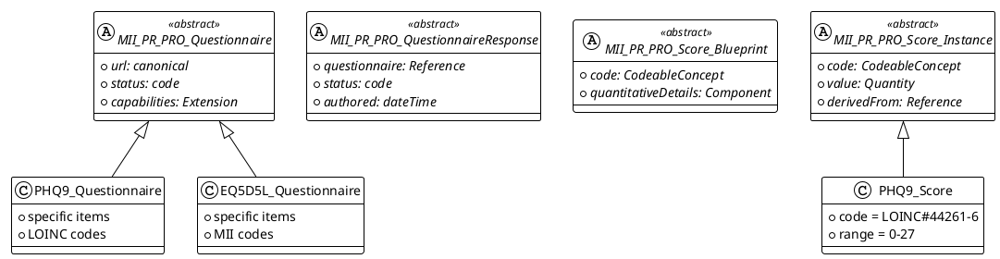

## Abstrakte Profile

Das MII PRO Modul definiert abstrakte Profile, die als Basis für alle PRO-Implementierungen dienen. Diese Profile sind als `abstract = true` markiert und sollen nicht direkt instanziiert werden. Sie etablieren die gemeinsamen Strukturen und Verhaltensweisen, die von spezifischen Instrumenten-Profilen erweitert werden müssen. Die beiden Profile für Questionnaire und QuestionnaireResponse erben dabei von den SDC-Spezifikation, während die beiden Score-Profile für Observation und ObservationDefinition direkt von der FHIR-Spezifikation erben. 

### Warum abstrakte Profile?

Abstrakte Profile stellen sicher, dass gemeinsame Strukturen konsistent über alle Implementierungen verwendet werden, während sie gleichzeitig verhindern, dass unvollständige oder generische Instanzen erstellt werden. Jedes PRO-Instrument muss ein konkretes Profil definieren, das von diesen abstrakten Profilen erbt und die instrument-spezifischen Details hinzufügt.

### MII_PR_PRO_Questionnaire (Abstract)

Das abstrakte Questionnaire-Profil bildet die Grundlage für alle PRO-Fragebögen. Es erweitert das FHIR R4 Questionnaire mit SDC-Capabilities und MII-spezifischen Extensions.

**Canonical URL:** `https://www.medizininformatik-initiative.de/fhir/ext/modul-pro/StructureDefinition/mii-pr-pro-questionnaire`
**Abstract:** `true`

**Kernelemente:**
- Verpflichtende URL zur eindeutigen Identifikation
- Status und Version für Lifecycle-Management
- Capability-Extensions zur Verhaltenssteuerung
- SDC-Extensions für erweiterte Funktionalität

<tabs>
  <tab title="Tree">
    {{tree:https://www.medizininformatik-initiative.de/fhir/ext/modul-pro/StructureDefinition/mii-pr-pro-questionnaire}}
  </tab>
  <tab title="JSON">
    {{json:https://www.medizininformatik-initiative.de/fhir/ext/modul-pro/StructureDefinition/mii-pr-pro-questionnaire}}
  </tab>
  <tab title="XML">
    {{xml:https://www.medizininformatik-initiative.de/fhir/ext/modul-pro/StructureDefinition/mii-pr-pro-questionnaire}}
  </tab>
</tabs>

### MII_PR_PRO_QuestionnaireResponse (Abstract)

Das abstrakte QuestionnaireResponse-Profil standardisiert die Struktur ausgefüllter Fragebögen. Konkrete Implementierungen müssen dieses Profil erweitern und instrument-spezifische Constraints hinzufügen.

**Canonical URL:** `https://www.medizininformatik-initiative.de/fhir/ext/modul-pro/StructureDefinition/mii-pr-pro-questionnaire-response`
**Abstract:** `true`

**Kernelemente:**
- Referenz zum zugehörigen Questionnaire
- Verpflichtender Status (completed, in-progress, etc.)
- Strukturierte Items mit Antworten
- Authored-Zeitstempel für Verlaufsdokumentation

<tabs>
  <tab title="Tree">
    {{tree:https://www.medizininformatik-initiative.de/fhir/ext/modul-pro/StructureDefinition/mii-pr-pro-questionnaire-response}}
  </tab>
  <tab title="JSON">
    {{json:https://www.medizininformatik-initiative.de/fhir/ext/modul-pro/StructureDefinition/mii-pr-pro-questionnaire-response}}
  </tab>
  <tab title="XML">
    {{xml:https://www.medizininformatik-initiative.de/fhir/ext/modul-pro/StructureDefinition/mii-pr-pro-questionnaire-response}}
  </tab>
</tabs>

### MII_PR_PRO_Score_Blueprint (Abstract)

Das abstrakte Score Blueprint Profil definiert die Struktur für ObservationDefinitions, die als Vorlagen für PRO-Scores dienen. Konkrete Score-Definitionen müssen dieses abstrakte Profil erweitern.

**Canonical URL:** `https://www.medizininformatik-initiative.de/fhir/ext/modul-pro/StructureDefinition/mii-pr-pro-score-blueprint`
**Abstract:** `true`

**Kernelemente:**
- Code zur eindeutigen Score-Identifikation (typischerweise LOINC)
- QuantitativeDetails mit Einheiten und Wertebereichen
- QualifiedInterval für Referenzbereiche
- Populationsspezifische Normwerte

<tabs>
  <tab title="Tree">
    {{tree:https://www.medizininformatik-initiative.de/fhir/ext/modul-pro/StructureDefinition/mii-pr-pro-score-blueprint}}
  </tab>
  <tab title="JSON">
    {{json:https://www.medizininformatik-initiative.de/fhir/ext/modul-pro/StructureDefinition/mii-pr-pro-score-blueprint}}
  </tab>
  <tab title="XML">
    {{xml:https://www.medizininformatik-initiative.de/fhir/ext/modul-pro/StructureDefinition/mii-pr-pro-score-blueprint}}
  </tab>
</tabs>

### MII_PR_PRO_Score_Instance (Abstract)

Das abstrakte Score Instance Profil definiert die Struktur für konkrete Score-Observations. Instrument-spezifische Score-Profile müssen von diesem abstrakten Profil erben.

**Canonical URL:** `https://www.medizininformatik-initiative.de/fhir/ext/modul-pro/StructureDefinition/mii-pr-pro-score-instance`
**Abstract:** `true`

**Kernelemente:**
- Status (final, preliminary, etc.)
- Code mit Score-Typ (LOINC oder MII-Code)
- ValueQuantity mit numerischem Score
- DerivedFrom-Referenz zur QuestionnaireResponse
- Instantiates-Referenz zur ObservationDefinition (R5 Backport)

<tabs>
  <tab title="Tree">
    {{tree:https://www.medizininformatik-initiative.de/fhir/ext/modul-pro/StructureDefinition/mii-pr-pro-score-instance}}
  </tab>
  <tab title="JSON">
    {{json:https://www.medizininformatik-initiative.de/fhir/ext/modul-pro/StructureDefinition/mii-pr-pro-score-instance}}
  </tab>
  <tab title="XML">
    {{xml:https://www.medizininformatik-initiative.de/fhir/ext/modul-pro/StructureDefinition/mii-pr-pro-score-instance}}
  </tab>
</tabs>

### Vererbungshierarchie

Die abstrakten Profile bilden die Basis einer klaren Vererbungshierarchie:

### Implementierungsregeln

Da diese Profile als abstrakt markiert sind, gelten folgende Regeln:

1. **Keine direkte Instanziierung**: FHIR-Server sollten die Erstellung von Ressourcen ablehnen, die direkt auf abstrakte Profile verweisen
2. **Vererbung erforderlich**: Jedes PRO-Instrument muss konkrete Profile definieren, die von den abstrakten Profilen erben
3. **Vollständige Spezifikation**: Konkrete Profile müssen alle abstrakten Elemente mit konkreten Werten oder Constraints versehen
4. **Validierung**: Validatoren prüfen, dass Instanzen nur konkrete Profile referenzieren

### Vorteile der abstrakten Profile

Die Verwendung abstrakter Profile bietet mehrere Vorteile für das MII PRO Modul:

- **Konsistenz**: Alle PRO-Implementierungen folgen derselben Grundstruktur
- **Typsicherheit**: Verhindert die Erstellung unvollständiger generischer Instanzen
- **Wartbarkeit**: Änderungen an gemeinsamen Strukturen erfolgen zentral in den abstrakten Profilen
- **Klarheit**: Deutliche Trennung zwischen Basis-Infrastruktur und konkreten Implementierungen
- **Interoperabilität**: Generische Verarbeitung möglich durch gemeinsame abstrakte Basis

### Migration bestehender Implementierungen

Bestehende Implementierungen, die die Profile bereits nutzen, müssen angepasst werden:

1. Die abstrakten Profile selbst werden mit `abstract = true` markiert
2. Konkrete Instrument-Profile bleiben unverändert (erben bereits von den abstrakten Profilen)
3. Instanzen müssen auf konkrete Profile verweisen, nicht auf die abstrakten
4. Validierung sollte aktualisiert werden, um abstract-Constraint zu prüfen