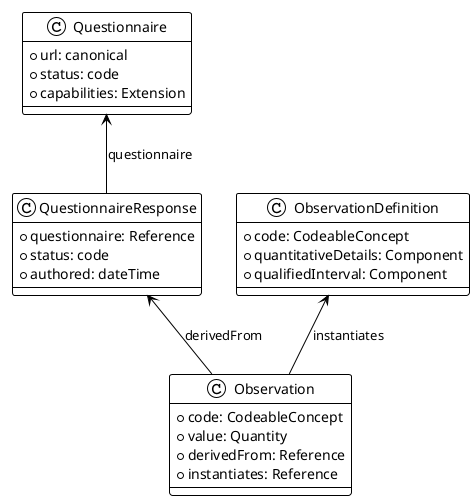

## Generische FHIR-Profile

Das MII PRO Modul definiert generische Profile, die als Basis für alle PRO-Implementierungen dienen. Diese Profile etablieren die gemeinsamen Strukturen und Verhaltensweisen, die von spezifischen Instrumenten erweitert werden.

### MII_PR_PRO_Questionnaire

Das Questionnaire-Profil bildet die Grundlage für alle PRO-Fragebögen. Es erweitert das FHIR R4 Questionnaire mit SDC-Capabilities und MII-spezifischen Extensions.

**Canonical URL:** `https://www.medizininformatik-initiative.de/fhir/ext/modul-pro/StructureDefinition/mii-pr-pro-questionnaire`

**Kernelemente:**
- Verpflichtende URL zur eindeutigen Identifikation
- Status und Version für Lifecycle-Management
- Capability-Extensions zur Verhaltenssteuerung
- SDC-Extensions für erweiterte Funktionalität

<tabs>
  <tab title="Tree">
    {{tree:https://www.medizininformatik-initiative.de/fhir/ext/modul-pro/StructureDefinition/mii-pr-pro-questionnaire}}
  </tab>
  <tab title="JSON">
    {{json:https://www.medizininformatik-initiative.de/fhir/ext/modul-pro/StructureDefinition/mii-pr-pro-questionnaire}}
  </tab>
  <tab title="XML">
    {{xml:https://www.medizininformatik-initiative.de/fhir/ext/modul-pro/StructureDefinition/mii-pr-pro-questionnaire}}
  </tab>
</tabs>

### MII_PR_PRO_QuestionnaireResponse

Das QuestionnaireResponse-Profil standardisiert die Struktur ausgefüllter Fragebögen. Es stellt sicher, dass alle Responses konsistent strukturiert und vollständig sind.

**Canonical URL:** `https://www.medizininformatik-initiative.de/fhir/ext/modul-pro/StructureDefinition/mii-pr-pro-questionnaire-response`

**Kernelemente:**
- Referenz zum zugehörigen Questionnaire
- Verpflichtender Status (completed, in-progress, etc.)
- Strukturierte Items mit Antworten
- Authored-Zeitstempel für Verlaufsdokumentation

<tabs>
  <tab title="Tree">
    {{tree:https://www.medizininformatik-initiative.de/fhir/ext/modul-pro/StructureDefinition/mii-pr-pro-questionnaire-response}}
  </tab>
  <tab title="JSON">
    {{json:https://www.medizininformatik-initiative.de/fhir/ext/modul-pro/StructureDefinition/mii-pr-pro-questionnaire-response}}
  </tab>
  <tab title="XML">
    {{xml:https://www.medizininformatik-initiative.de/fhir/ext/modul-pro/StructureDefinition/mii-pr-pro-questionnaire-response}}
  </tab>
</tabs>

### MII_PR_PRO_Score_Blueprint (ObservationDefinition)

Das Score Blueprint Profil definiert die Struktur für ObservationDefinitions, die als Vorlagen für PRO-Scores dienen. Diese Blueprints spezifizieren, wie Scores interpretiert und validiert werden sollen.

**Canonical URL:** `https://www.medizininformatik-initiative.de/fhir/ext/modul-pro/StructureDefinition/mii-pr-pro-score-blueprint`

**Kernelemente:**
- Code zur eindeutigen Score-Identifikation (typischerweise LOINC)
- QuantitativeDetails mit Einheiten und Wertebereichen
- QualifiedInterval für Referenzbereiche
- Populationsspezifische Normwerte

<tabs>
  <tab title="Tree">
    {{tree:https://www.medizininformatik-initiative.de/fhir/ext/modul-pro/StructureDefinition/mii-pr-pro-score-blueprint}}
  </tab>
  <tab title="JSON">
    {{json:https://www.medizininformatik-initiative.de/fhir/ext/modul-pro/StructureDefinition/mii-pr-pro-score-blueprint}}
  </tab>
  <tab title="XML">
    {{xml:https://www.medizininformatik-initiative.de/fhir/ext/modul-pro/StructureDefinition/mii-pr-pro-score-blueprint}}
  </tab>
</tabs>

### MII_PR_PRO_Score_Instance (Observation)

Das Score Instance Profil definiert die Struktur für konkrete Score-Observations. Diese Observations enthalten die berechneten Scores aus QuestionnaireResponses.

**Canonical URL:** `https://www.medizininformatik-initiative.de/fhir/ext/modul-pro/StructureDefinition/mii-pr-pro-score-instance`

**Kernelemente:**
- Status (final, preliminary, etc.)
- Code mit Score-Typ (LOINC oder MII-Code)
- ValueQuantity mit numerischem Score
- DerivedFrom-Referenz zur QuestionnaireResponse
- Instantiates-Referenz zur ObservationDefinition (R5 Backport)

<tabs>
  <tab title="Tree">
    {{tree:https://www.medizininformatik-initiative.de/fhir/ext/modul-pro/StructureDefinition/mii-pr-pro-score-instance}}
  </tab>
  <tab title="JSON">
    {{json:https://www.medizininformatik-initiative.de/fhir/ext/modul-pro/StructureDefinition/mii-pr-pro-score-instance}}
  </tab>
  <tab title="XML">
    {{xml:https://www.medizininformatik-initiative.de/fhir/ext/modul-pro/StructureDefinition/mii-pr-pro-score-instance}}
  </tab>
</tabs>

### Beziehungen zwischen Profilen

Die generischen Profile bilden ein zusammenhängendes System, in dem jedes Profil eine spezifische Rolle im PRO-Workflow erfüllt:

### Verwendung in spezifischen Instrumenten

Alle spezifischen PRO-Instrumente (PHQ-9, EQ-5D-5L, etc.) basieren auf diesen generischen Profilen. Die Instrumente fügen instrument-spezifische Constraints und Inhalte hinzu, folgen aber der etablierten Struktur. Diese Konsistenz ermöglicht generische Verarbeitung bei gleichzeitiger Flexibilität für spezifische Anforderungen.

### Suchparameter

Für alle Profile sind folgende Suchparameter relevant:

| Parameter | Verwendung | Beispiel |
|-----------|------------|----------|
| `_id` | Direkte Ressourcen-Suche | `GET [base]/Questionnaire?_id=phq9` |
| `_profile` | Suche nach Profil-Typ | `GET [base]/Observation?_profile=.../mii-pr-pro-score-instance` |
| `questionnaire` | QuestionnaireResponses für spezifischen Fragebogen | `GET [base]/QuestionnaireResponse?questionnaire=Questionnaire/phq9` |
| `derived-from` | Observations von spezifischer Response | `GET [base]/Observation?derived-from=QuestionnaireResponse/123` |

### Implementierungshinweise

Die generischen Profile sollten nicht direkt instanziiert werden. Stattdessen sollten immer die spezifischen Instrument-Profile verwendet werden, die auf diesen generischen Profilen basieren. Die generischen Profile dienen primär als strukturelle Basis und zur Sicherstellung der Konsistenz über alle PRO-Implementierungen hinweg.