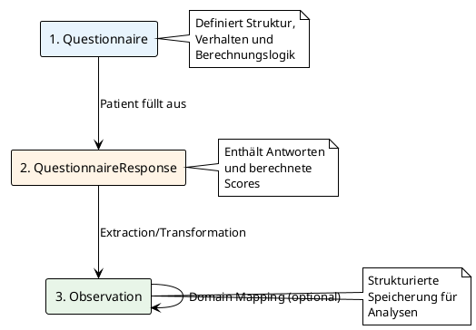
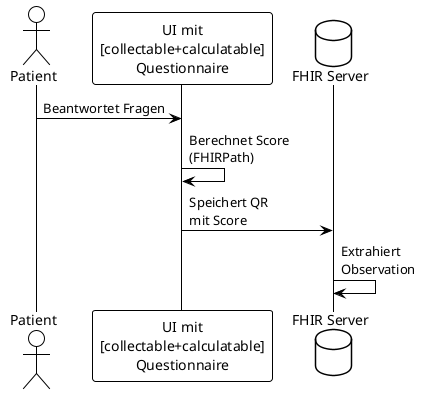
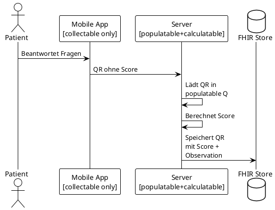
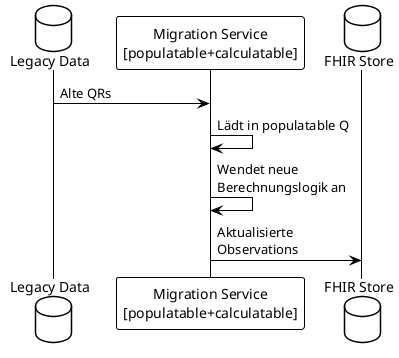
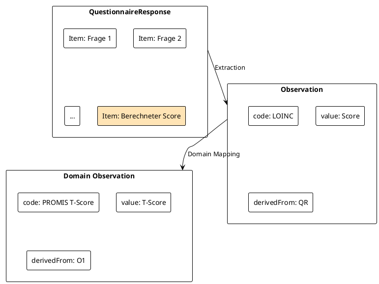
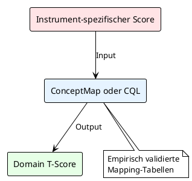

## Workflow-Patterns und Implementierungsansätze

### Standard MII PRO Workflow

Der MII PRO Workflow folgt einem dreistufigen Prozess von der Datenerfassung bis zur strukturierten Speicherung:



### Capability-basierte Workflow-Varianten

Die Questionnaire-Capabilities ermöglichen verschiedene Implementierungsszenarien. Ein Fragebogen kann mehrere Capabilities kombinieren, um spezifische Workflows zu unterstützen.

#### Szenario 1: Direkte Erfassung mit Echtzeit-Berechnung



**Verwendete Capabilities:** collectable, calculatable, displayable, extractable

#### Szenario 2: Mobile Erfassung → Server-Berechnung



**Verwendete Capabilities:** 
- Client: collectable
- Server: populatable, calculatable, extractable

#### Szenario 3: Historische Neuberechnung



**Verwendete Capabilities:** populatable, calculatable, extractable

### Score-Repräsentationsebenen

PRO-Scores existieren auf verschiedenen Ebenen im System:



### Implementierungsmuster

#### Calculated Expressions

Scores werden mittels FHIRPath-Expressions berechnet:

```fhirpath
// Einfache Summe
%resource.item.answer.value.ordinal().sum()

// Gewichtete Summe mit Selektion
%resource.item.where(linkId.matches('^item-[1-9]$'))
  .answer.value.ordinal().sum()

// Mit Variablen für komplexe Berechnungen
%rawScore = %resource.item.answer.value.ordinal().sum()
iif(%rawScore < 5, 'minimal', 
    iif(%rawScore < 10, 'mild', 'moderate'))
```

#### Initial Expressions für Populatable

Vorausfüllung aus existierenden Daten:

```fhirpath
// Einzelnes Item
iif(%sourceResponse.exists(), 
    %sourceResponse.item.where(linkId='q1').answer.value, 
    {})

// Mit Fallback
%sourceResponse.item.where(linkId='q1').answer.value | {}
```

#### Extraction zu Observations

Die Transformation erfolgt über SDC-Extraction-Extensions oder server-seitige Logik:

```fsh
* item.extension[observationExtract] = true
* item.code = $LNC#44261-6 "PHQ-9 total score"
```

### Domain-Mapping Patterns



### Best Practices

#### Capability-Auswahl

Die Auswahl der Capabilities sollte sich nach dem Anwendungsfall richten:

- **Patientenportale:** collectable + calculatable + displayable
- **Mobile Apps:** Nur collectable (minimaler Footprint)
- **Server-Systeme:** populatable + calculatable + extractable
- **Reporting-Systeme:** Nur displayable

#### Performance-Überlegungen

- Berechnungen in der UI nur bei kleinen Fragebögen
- Server-seitige Berechnung für komplexe Scores
- Caching von ObservationDefinitions
- Batch-Processing für historische Daten

#### Fehlerbehandlung

- Validierung aller Pflichtfelder vor Score-Berechnung
- Klare Fehlermeldungen bei ungültigen Werten
- Fallback-Strategien für fehlende Capabilities
- Logging von Mapping-Fehlern

### Zusammenfassung

Die MII PRO Workflow-Patterns ermöglichen flexible Implementierungen bei gleichzeitiger Standardisierung. Durch die Capability-Architektur können Systeme genau die Funktionalität implementieren, die sie benötigen, während die Interoperabilität gewahrt bleibt. Alle spezifischen Instrumente (PHQ-9, EQ-5D-5L, etc.) folgen diesen Patterns und erweitern sie nur um instrument-spezifische Details.